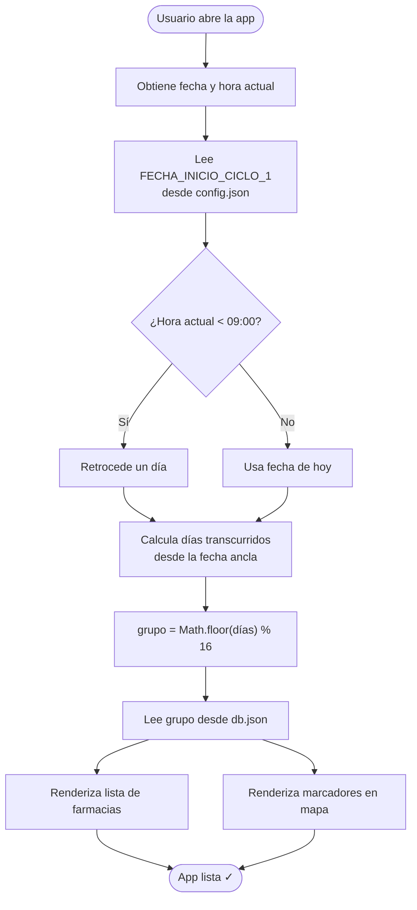
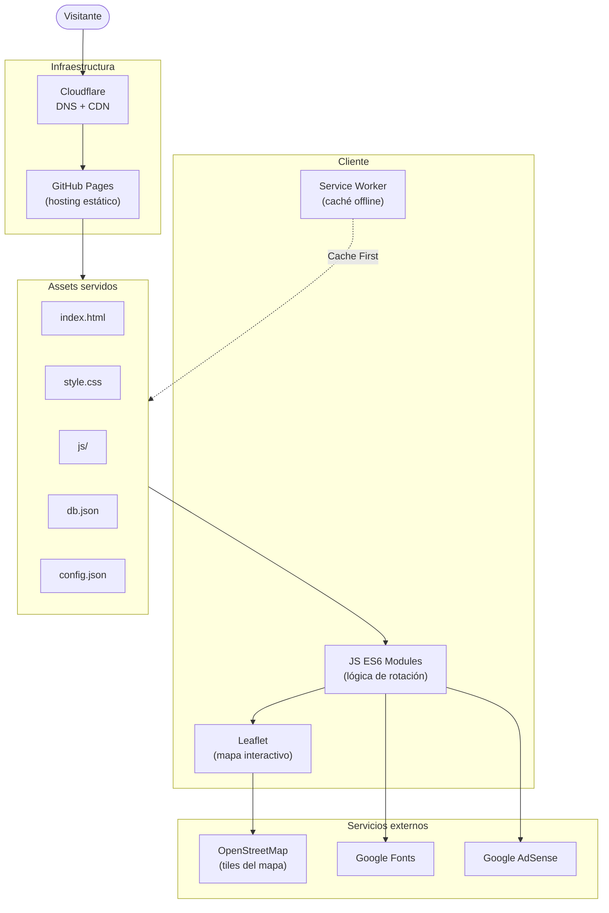
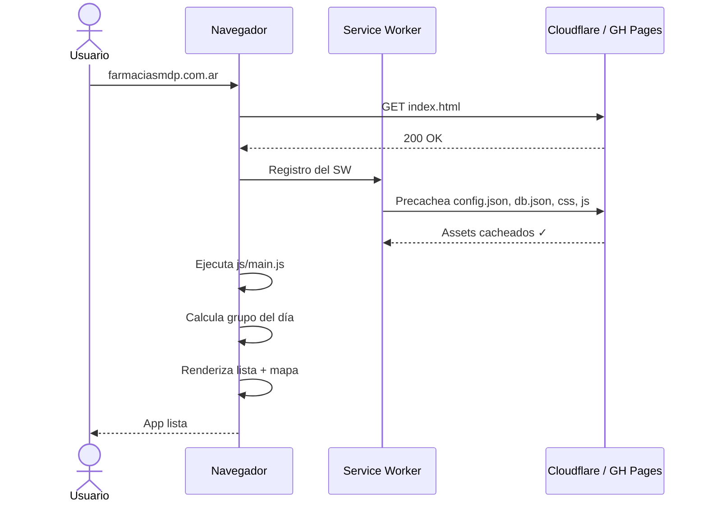
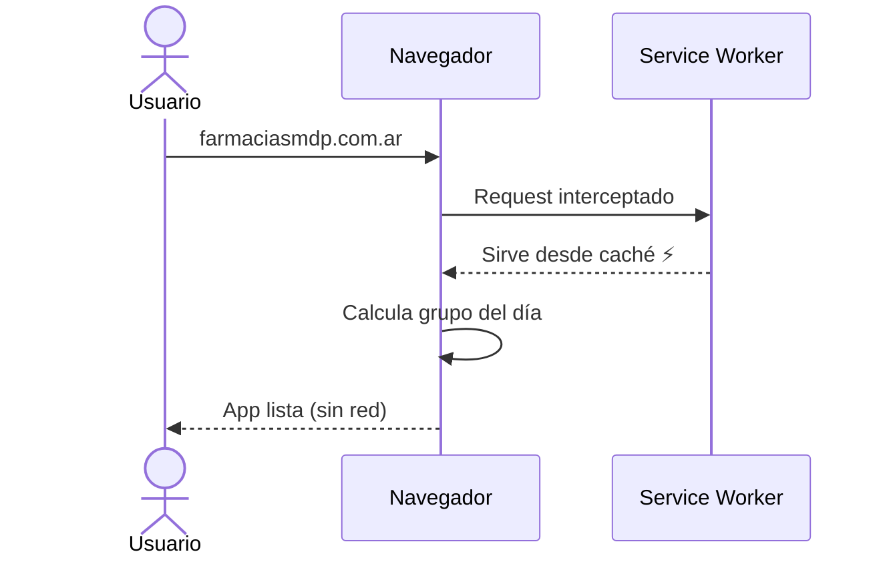
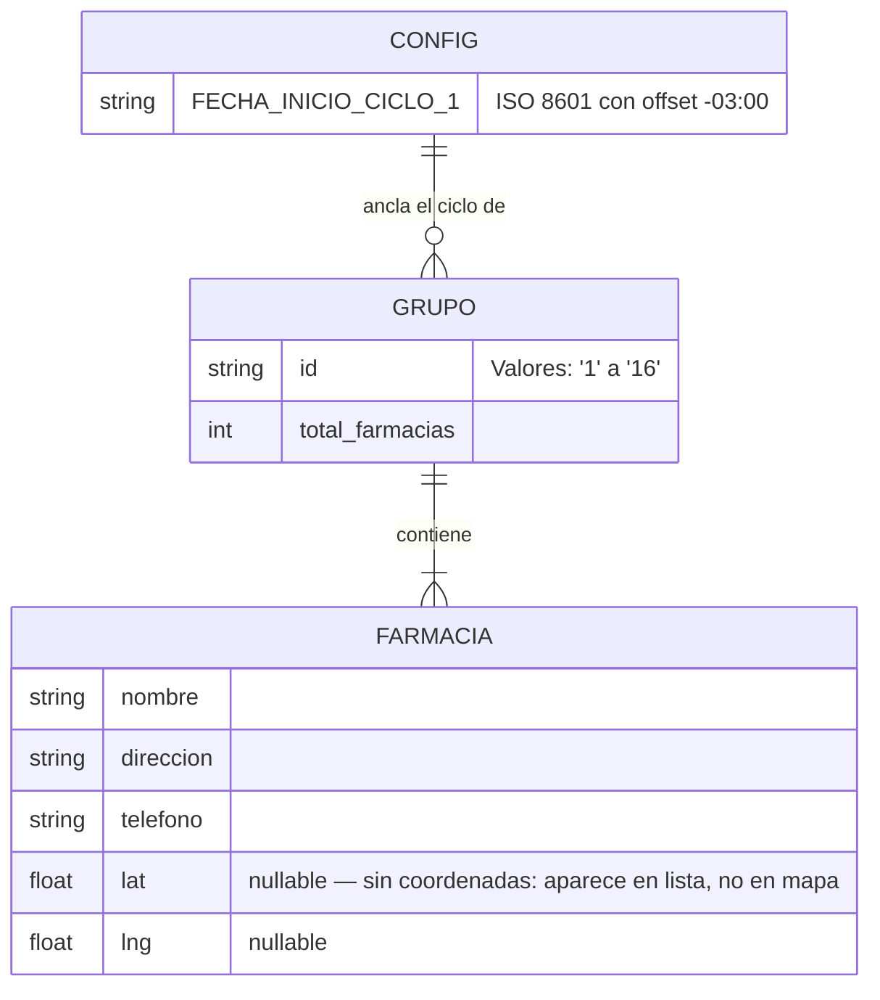
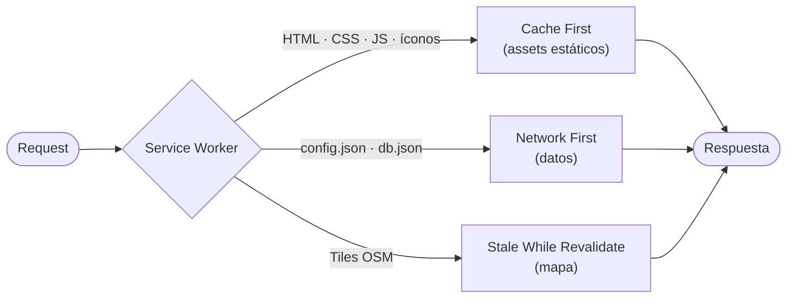

# Farmacias de Turno MDP

> PWA estática que calcula la rotación diaria de farmacias de turno en Mar del Plata, Argentina, mediante un modelo matemático determinístico. Sin backend, sin scraping, sin dependencias.

[](https://farmaciasmdp.com.ar/)
[](https://github.com/psbella/turnos)
[](https://creativecommons.org/licenses/by-nc/4.0/)
[](https://web.dev/progressive-web-apps/)
[](https://github.com/psbella/turnos)
[](https://developer.mozilla.org/es/docs/Web/HTML)
[](https://developer.mozilla.org/es/docs/Web/CSS)
[](https://developer.mozilla.org/es/docs/Web/JavaScript)
[](https://leafletjs.com/)
[](https://pages.github.com/)
[](https://www.cloudflare.com/)

**→ [farmaciasmdp.com.ar](https://farmaciasmdp.com.ar)**

---

## Tabla de contenidos

- [Descripción](#descripción)
- [Cómo funciona la rotación](#cómo-funciona-la-rotación)
- [Arquitectura del sistema](#arquitectura-del-sistema)
- [Estructura del proyecto](#estructura-del-proyecto)
- [Stack tecnológico](#stack-tecnológico)
- [Flujo de usuario](#flujo-de-usuario)
- [Modelo de datos](#modelo-de-datos)
- [Estrategia de caché (PWA)](#estrategia-de-caché-pwa)
- [Instalación local](#instalación-local)
- [Proyectos relacionados](#proyectos-relacionados)
- [Licencia](#licencia)

---

## Descripción

El Colegio de Farmacéuticos de General Pueyrredon organiza las farmacias de Mar del Plata en **16 grupos rotativos**. Esta aplicación replica esa lógica de forma completamente local: dado un punto de ancla conocido (`FECHA_INICIO_CICLO_1`) y la fecha actual, se calcula el grupo de turno con una operación de módulo. No hay llamadas a APIs externas para determinar el turno.

La app es instalable como PWA, funciona offline gracias a un Service Worker y está optimizada para SEO con Schema.org, Open Graph y sitemap.

---

## Cómo funciona la rotación

```
grupo_hoy = Math.floor( diasDesde(FECHA_INICIO_CICLO_1, ahora) ) % 16
```

El cambio de turno ocurre a las **09:00 hs (UTC-3)**. Si el usuario consulta antes de esa hora, se usa la fecha del día anterior.



---

## Arquitectura del sistema

La aplicación es **100% estática**: no existe servidor de aplicaciones. GitHub Pages sirve los archivos, Cloudflare actúa como CDN y proxy DNS, y toda la lógica de negocio corre en el navegador del usuario.



---

## Estructura del proyecto

```
turnos/
├── index.html                  # Entry point — contenido SSG para SEO + bootstrap JS
├── style.css                   # Estilos globales con CSS custom properties (dark/light)
├── sw.js                       # Service Worker — estrategia de caché multi-capa
├── manifest.json               # Web App Manifest (PWA)
│
├── config.json                 # Fecha ancla del ciclo
│                               #   { "FECHA_INICIO_CICLO_1": "2026-04-26T09:00:00-03:00" }
│
├── db.json                     # Base de datos de farmacias
│                               #   { "1": [ {nombre, direccion, telefono, lat, lng}, ... ],
│                               #     ...
│                               #    "16": [ ... ] }
│
├── js/
│   └── main.js                 # Módulo principal — inicializa UI, mapa y rotación
│
├── admin-map.html              # Herramienta interna para auditar coordenadas
├── privacidad.html             # Política de privacidad
├── terminos.html               # Términos de uso
│
├── sitemap.xml                 # Sitemap para crawlers
├── robots.txt                  # Directivas de indexación
├── ads.txt                     # Autorización Google AdSense
├── CNAME                       # → farmaciasmdp.com.ar
│
├── icon-16.png
├── icon-32.png
├── icon-48.png
├── icon-96.png
└── icon-512.png                # Ícono PWA splash
```

---

## Stack tecnológico

| Capa | Tecnología | Notas |
|---|---|---|
| Markup | HTML5 | Contenido SSG inline para SEO; Schema.org embebido |
| Estilos | CSS3 + Custom Properties | Dark/light mode sin JS, mobile-first |
| Lógica | JavaScript ES6+ Modules | Sin frameworks, sin bundler |
| Mapas | Leaflet 1.x + OpenStreetMap | Marcadores SVG personalizados |
| PWA | Service Worker + Web App Manifest | Cache API, instalable |
| Hosting | GitHub Pages | Deploy en cada push a `main` |
| CDN / DNS | Cloudflare | HTTPS, caché edge, analytics |
| SEO | Schema.org · Open Graph · Twitter Cards | Structured data + sitemap.xml |
| Fuentes | Google Fonts | Bebas Neue (display) + Nunito (body) |
| Publicidad | Google AdSense | — |
| Monitoreo | Google Search Console · Cloudflare Analytics | Sin cookies propias |

---

## Flujo de usuario

### Primer acceso (red disponible)



### Accesos siguientes (con o sin red)



---

## Modelo de datos



**Notas sobre la calidad de los datos:**

- `MITRE (Colón 2690)` aparece en los 16 grupos — es farmacia de turno permanente.
- Al menos una farmacia tiene `lat: null` (grupo 10) — se muestra en la lista pero no en el mapa.

---

## Estrategia de caché (PWA)



El manifest declara `display: standalone` y `start_url: /`, por lo que la app se comporta como nativa una vez instalada desde el navegador.

---


## Instalación local

> **Requisito**: servir con un servidor HTTP local. Los módulos ES6 y el Service Worker no funcionan con `file://`.

```bash
# Clonar el repositorio
git clone https://github.com/psbella/turnos.git
cd turnos

# Opción A — Python (sin instalar nada)
python3 -m http.server 8080

# Opción B — Node.js
npx serve .

# Opción C — VS Code + extensión Live Server
# Clic derecho en index.html → "Open with Live Server"
```

Luego abrir `http://localhost:8080` en el navegador.

---

## Proyectos relacionados

| Proyecto | Descripción |
|---|---|
| [remedi.ar](https://remedi.ar) | Buscador de precios de medicamentos en farmacias de Argentina |

---

## Licencia

Distribuido bajo [Creative Commons BY-NC 4.0](https://creativecommons.org/licenses/by-nc/4.0/).
Podés usar y adaptar el código con atribución, pero no con fines comerciales.

---

<div align="center">
  Hecho en Mar del Plata, Argentina
</div>
