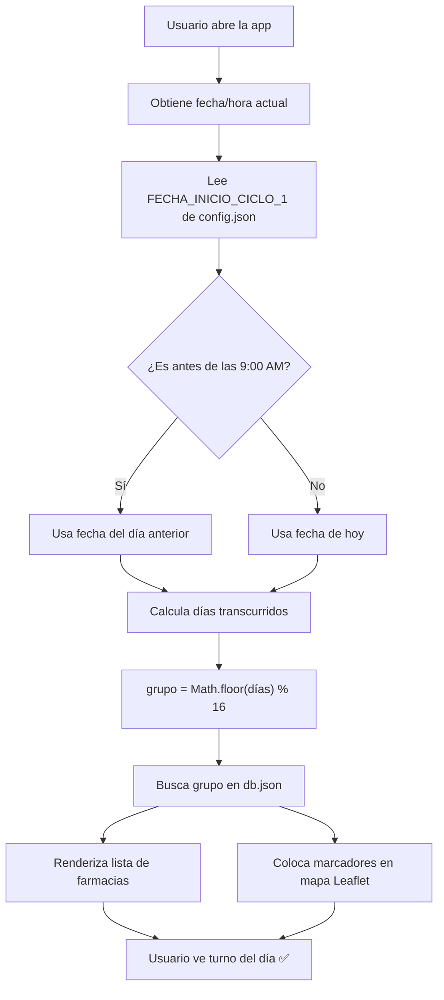
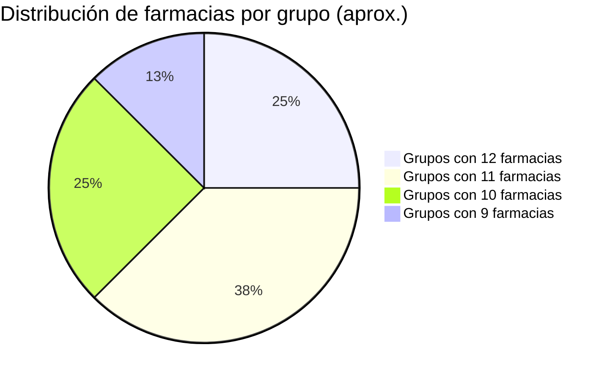
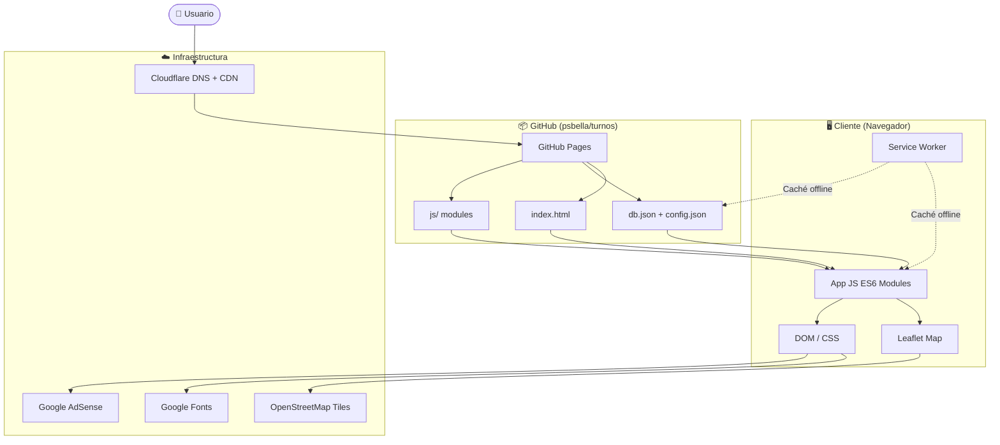
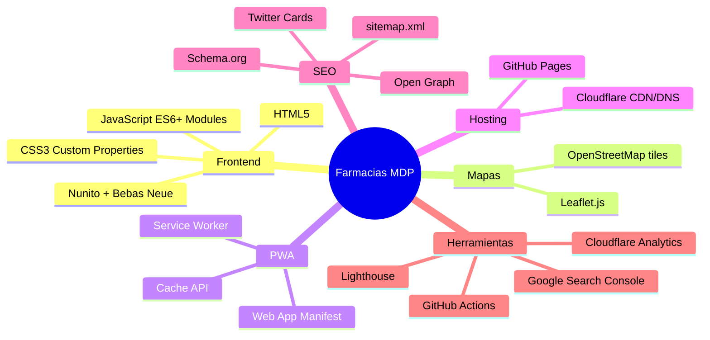
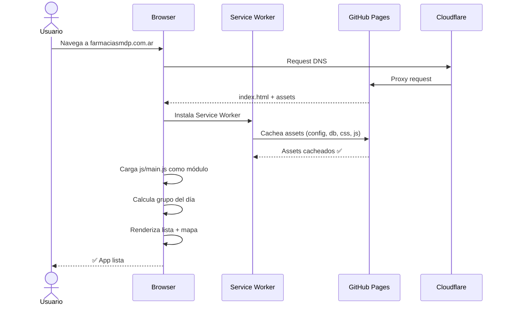
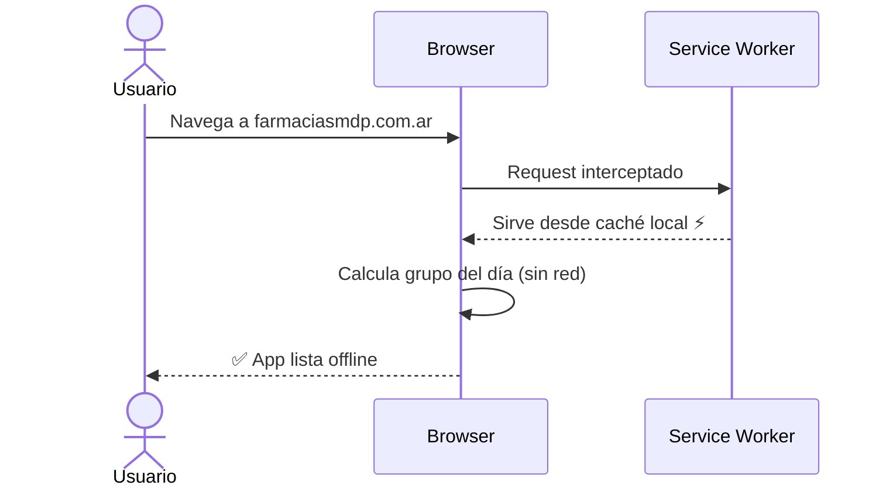
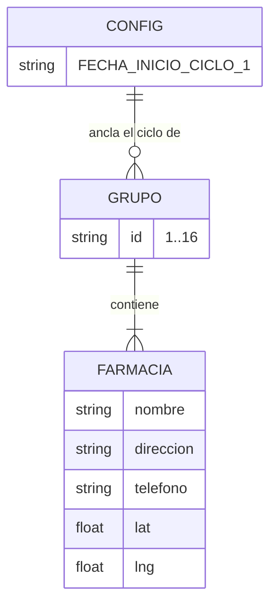
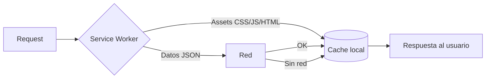

# 💊 Farmacias de Turno MDP

**PWA que calcula la rotación diaria de farmacias de turno en Mar del Plata, Argentina, usando un modelo matemático determinístico.**

[](https://farmaciasmdp.com.ar/)
[](https://github.com/psbella/turnos)
[](https://creativecommons.org/licenses/by-nc/4.0/)
[](https://web.dev/progressive-web-apps/)
[](https://github.com/psbella/turnos)
[](https://developer.mozilla.org/es/docs/Web/HTML)
[](https://developer.mozilla.org/es/docs/Web/CSS)
[](https://developer.mozilla.org/es/docs/Web/JavaScript)
[](https://leafletjs.com/)
[](https://pages.github.com/)
[](https://www.cloudflare.com/)

---

## 🌐 Demo en vivo

**→ [farmaciasmdp.com.ar](https://farmaciasmdp.com.ar)**

---

## 📋 Índice

- [¿Qué es?](#-qué-es)
- [Características](#-características)
- [Cómo funciona la rotación](#-cómo-funciona-la-rotación)
- [Arquitectura](#-arquitectura)
- [Estructura de archivos](#-estructura-de-archivos)
- [Stack tecnológico](#-stack-tecnológico)
- [Flujo de la aplicación](#-flujo-de-la-aplicación)
- [Datos y fuentes](#-datos-y-fuentes)
- [PWA y offline](#-pwa-y-offline)
- [Instalación local](#️-instalación-local)
- [Licencia](#-licencia)

---

## 🏥 ¿Qué es?

Farmacias de Turno MDP es una **Progressive Web App (PWA)** estática que permite consultar rápidamente qué farmacia está de turno en Mar del Plata en cualquier momento. No hace scraping, no tiene backend, no requiere servidor: toda la lógica corre en el navegador del usuario usando un modelo matemático basado en la fecha actual.

---

## ✨ Características

| Feature | Detalle |
|---|---|
| 🗺️ **Mapa interactivo** | Leaflet + OpenStreetMap con marcadores personalizados |
| 🔄 **Rotación automática** | Cálculo determinístico, sin APIs externas |
| 📱 **Responsive** | Mobile-first, bottom sheet en móvil, grid en desktop |
| 🌙 **Modo claro/oscuro** | Toggle manual, persiste preferencia |
| 📲 **Instalable (PWA)** | Funciona como app nativa en iOS y Android |
| ♿ **Accesible** | Roles ARIA, navegación por teclado (WCAG AAA) |
| ⚡ **Offline-first** | Service Worker con caché multi-capa |
| 📊 **SEO completo** | Schema.org, Open Graph, sitemap, robots.txt |
| 🔒 **Sin tracking** | No cookies propias, no recopila datos personales |

---

## 🧠 Cómo funciona la rotación

El Colegio de Farmacéuticos de General Pueyrredon organiza las farmacias en **16 grupos rotativos**. La app replica esta lógica de forma puramente matemática:

```
grupo_hoy = Math.floor(diasDesde(FECHA_INICIO)) % 16
```

Donde `FECHA_INICIO = 2026-04-26T09:00:00-03:00` es el ancla conocida del ciclo 1.



### Ciclo de 16 grupos



---

## 🏗️ Arquitectura

La app es **100% estática**: HTML + CSS + JS vanilla servido desde GitHub Pages, con DNS y CDN via Cloudflare.



---

## 📁 Estructura de archivos

```
turnos/
│
├── index.html              # Entry point — SEO hardcodeado + carga JS modular
├── style.css               # Estilos globales (dark/light mode, variables CSS)
├── sw.js                   # Service Worker — caché offline multi-capa
├── manifest.json           # PWA manifest (iconos, nombre, colores)
│
├── config.json             # Fecha ancla del ciclo 1
│                           # { "FECHA_INICIO_CICLO_1": "2026-04-26T09:00:00-03:00" }
│
├── db.json                 # Base de datos de farmacias
│                           # { "1": [...], "2": [...], ..., "16": [...] }
│
├── js/
│   ├── main.js             # Entry JS — inicialización, carga config + db
│   └── ...                 # Módulos ES6 (mapa, UI, rotación, etc.)
│
├── admin-map.html          # Herramienta interna para verificar coordenadas
├── privacidad.html         # Política de privacidad
├── terminos.html           # Términos de uso
│
├── sitemap.xml             # SEO sitemap
├── robots.txt              # Directivas para crawlers
├── ads.txt                 # Autorización AdSense
├── CNAME                   # → farmaciasmdp.com.ar
│
├── icon-16.png             # Favicon
├── icon-32.png
├── icon-48.png
├── icon-96.png
├── icon-512.png            # PWA splash icon
│
└── .gitignore
```

---

## 🛠️ Stack tecnológico



---

## 🔄 Flujo de la aplicación

### Primer acceso



### Accesos siguientes (offline)



---

## 📊 Datos y fuentes

Los datos de farmacias (nombre, dirección, teléfono, coordenadas) están almacenados en `db.json`, organizados en 16 grupos. La fecha ancla del ciclo está en `config.json`.



### Notas sobre los datos

> ⚠️ **Coordenadas nulas**: Hay al menos una farmacia con `lat: null` (MILAZZO, grupo 10). No aparece en el mapa pero sí en la lista.
>
> ⚠️ **Farmacia permanente**: MITRE (Colón 2690) aparece en todos los grupos — es de turno permanente.

---

## 📲 PWA y offline

La app implementa una estrategia **Cache First** para assets estáticos y **Network First** para los datos JSON:



El manifest define:
- `display: standalone` — se ve como app nativa
- `start_url: /` — abre desde el ícono directo al turno del día
- `theme_color: #0d1117` — dark mode por defecto

---

## 🖥️ Vistas

### Mobile (< 768px)
- Lista vertical de farmacias
- Botón flotante "Ver mapa" → bottom sheet deslizable
- Botón "Instalar app" si el dispositivo lo soporta

### Desktop (≥ 768px)
- Grid de 2 columnas: lista izquierda + mapa sticky derecha
- Mapa Leaflet de 500px de altura
- Hover effects en cards

```
Mobile                          Desktop
┌──────────────────┐           ┌─────────────┬─────────────┐
│ 💊 FARMACIAS MDP │           │ 💊 FARMACIAS│             │
│ [🌙 toggle]      │           │             │  [MAPA      │
├──────────────────┤           ├─────────────┤   LEAFLET   │
│ ┌──────────────┐ │           │ ┌─────────┐ │   sticky]   │
│ │ 1. FARMACIA  │ │           │ │1.FARM.  │ │             │
│ │ Dirección    │ │           │ └─────────┘ │             │
│ │ 📞 tel       │ │           │ ┌─────────┐ │             │
│ └──────────────┘ │           │ │2.FARM.  │ │             │
│ ...              │           │ └─────────┘ │             │
├──────────────────┤           └─────────────┴─────────────┘
│ [VER MAPA 🗺️]   │
└──────────────────┘
     [bottom sheet]
┌──────────────────┐
│ ── [cerrar]      │
│  [MAPA LEAFLET]  │
│                  │
└──────────────────┘
```

---

## ⚙️ Instalación local

```bash
# 1. Clonar el repositorio
git clone https://github.com/psbella/turnos.git
cd turnos

# 2. Servir con cualquier servidor HTTP local
# Opción A — Python
python3 -m http.server 8080

# Opción B — Node.js
npx serve .

# Opción C — VS Code
# Instalar extensión "Live Server" y hacer clic en "Go Live"

# 3. Abrir en el navegador
# http://localhost:8080
```

> **Nota**: Abrir `index.html` directamente como `file://` no funciona correctamente para el Service Worker ni para los módulos ES6. Siempre servir con un servidor HTTP local.

---

## 🔗 Proyectos relacionados

| Proyecto | Descripción |
|---|---|
| [remedi.ar](https://remedi.ar) | Buscador de precios de medicamentos en Argentina |

---

## 📄 Licencia

[Creative Commons BY-NC 4.0](https://creativecommons.org/licenses/by-nc/4.0/) — Podés usar y adaptar el código con atribución, pero no para fines comerciales.

---

<div align="center">
  Hecho con ❤️ en Mar del Plata, Argentina<br>
  <a href="https://farmaciasmdp.com.ar">farmaciasmdp.com.ar</a>
</div>
